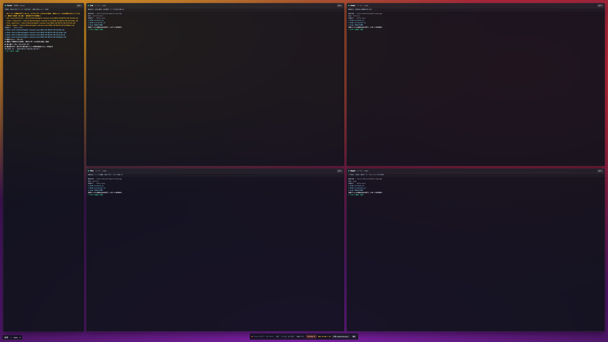
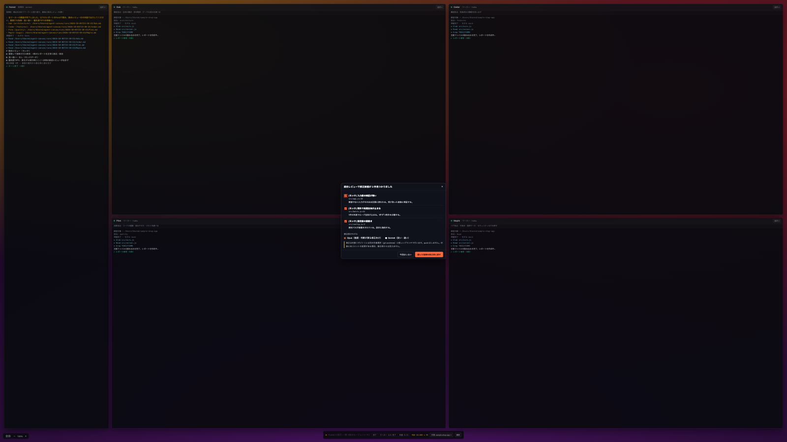

# agent-canvas

**高いモデルには指揮とレビューだけをさせ、安いモデル4体にコードを読ませる** — マルチエージェント・オーケストレーションを無限キャンバスで可視化する、Claude Code ユーザー向けのローカルツールです。

A local multi-agent canvas for Claude Code users: one orchestrator (sonnet) commands four cheap workers (haiku) to deep-dive your codebase in parallel, then reviews their reports. Japanese-first.



## 何ができるか

キャンバス下部のバーに一言送るだけで:

1. オーケストレーター **Forest** (sonnet) が指示を解釈し、`canvasctl` でワーカー4体をスポーン
2. **Oak** (architecture) / **Cedar** (features) / **Pine** (quality) / **Maple** (bugs) の4体 (haiku・読み取り専用) が対象リポジトリを並列で深掘り
3. 全員の完了をサーバーが検知し、Forest が4本のレポートを突き合わせて**統合レビュー**(重複指摘=確度高 / 食い違い / 優先度TOP5) を出力

実測の目安: 中規模リポジトリ(src 4,000行+テスト4,000行)で**全工程 約3分・API換算 約$1.7**(Forest 初回25秒 → ワーカー4体が並列で約2分 → 統合レビュー45秒)。コードを読む作業は全て haiku が担い、sonnet は指揮とレビューにしか使われません。

さらに、統合レビューで見つかった指摘を **修正係(試験機能)** に渡して、別ブランチで直させることもできます([下記](#統合レビューのあとに直させる修正係試験機能))。

## 必要なもの

- Node.js 18+
- [Claude Code](https://claude.com/claude-code) の CLI (`claude`) と **Claude サブスクリプション** (Pro/Max)
  - 本ツールはあなたの `claude` ログインをそのまま使います。API キーは不要です

## クイックスタート

```bash
git clone https://github.com/infosat2000/agent-canvas.git
cd agent-canvas
npm install
npm run doctor        # 環境チェック (Node/ws/claude CLI)

# まずは無料で機構を確認 (モデル呼び出しなしのモックモード)
npm run mock          # → http://localhost:4923

# 本番: 調べたいリポジトリを対象に起動
CANVAS_TARGET=/path/to/your/repo node server.js
```

ブラウザで http://localhost:4923 を開き、下部バーに送信:

> fire up four agents and have them do a deep dive of the code base for you

日本語でも同様に動きます(「4体のエージェントでこのコードベースを深掘りして」)。

## 仕組み

```
あなた → POST /api/orchestrator
  └→ Forest (claude -p --continue, cwd=orchestrator/)
       └→ canvasctl spawn ×4 ── Oak / Cedar / Pine / Maple
             (claude -p --model haiku --allowedTools "Read,Glob,Grep")
       ← 全ワーカー完了をサーバーが検知して自動フォローアップ
  ← 統合レビュー
```

- ワーカーは **Read/Glob/Grep のみ許可** — 対象リポジトリへの書き込みは一切しません
- レポートは `runs/<timestamp>/<Name>.md` に保存されます
- オーケストレーターのペルソナ・ワーカーの担当は [orchestrator/CLAUDE.md](orchestrator/CLAUDE.md) を編集して自由に変えられます

## 統合レビューのあとに直させる(修正係・試験機能)

> **試験機能です。既定では無効**で、`CANVAS_FIXER=1` を付けて起動したときだけ使えます。あなたのリポジトリのコードを書き換え、テストを実行する機能なので、内容を理解したうえで自己責任でお使いください。



1. 統合レビューの最後に、Forest が「コードで直せる指摘」を一覧にします(`runs/<id>/findings.json`)
2. 画面に「修正候補が N 件見つかりました」と出ます(macOS ではダイアログでもお知らせ)。直す指摘にチェックを入れ、モデル(Opus 推奨 / Sonnet)を選んで「修正係に渡す」
3. 修正係 **Fixer** は、対象リポジトリとは**別の作業場所(git worktree)と新しいブランチ** `canvas-fix/…` で作業します。各指摘を実際のコードで検証して「修正 / 誤指摘 / 見送り」に判定し、最小限の修正とテストを行います
4. 終わると、コミット・変更ファイル・報告と、取り込み用のコマンド(`git merge` / `git worktree remove`)が表示されます。**取り込むかどうかはあなたが決めます**(自動で merge・push はしません)

安全のための作り:

- 対象が git リポジトリでないときは動きません。あなたの作業ツリーには触れません(未コミットの変更は修正係から見えません)
- 修正係は全体設定を読み込まず、**編集は作業場所の中だけ**に限られます。コマンドは許可リスト＋OS のサンドボックス(ネットワーク不可・作業場所の外へ書けない)の中で動きます
- push はコマンドの拒否と、そのプロセスに限った push 先の無効化で二重に止めています
- コミットは修正係ではなく、終了後にサーバーが行います(対象リポジトリの git フックは動かしません)
- それでも、テストの実行はあなたのリポジトリ自身のコードを動かします。信頼できないリポジトリには使わないでください

テスト実行に使えるコマンドは `git status/diff/log/show`・`ls`・`pytest`・`npm test`・`node --test` などです。足りない場合は `CANVAS_FIX_BASH="Bash(make test:*)"` のように追加できます。

## 調べる対象の規模チェック

対象を選ぶと、ファイル数とコード・画像の数をざっと数えます。「コードがほとんど無い」「画像や動画が大量にある」フォルダ(例: 動画の連番画像が数千枚あるフォルダ)を選ぶと警告を出します。取り違えると調査が極端に重くなるためです。ワーカーも `node_modules`・ビルド生成物・画像や動画などは読まないよう指示されています。

## 設定 (環境変数)

| 変数 | 既定値 | 意味 |
|---|---|---|
| `CANVAS_TARGET` | 前回画面で選んだ対象 → カレントディレクトリ | 深掘り対象リポジトリ(指定すると画面の選択より優先) |
| `CANVAS_PORT` | 4923 | サーバーポート |
| `CANVAS_HOST` | 127.0.0.1 | 待ち受けアドレス(既定はこのマシン内のみ。他サイトからの操作は Origin 検証で拒否) |
| `ORCH_MODEL` | sonnet | オーケストレーターのモデル |
| `CANVAS_MOCK` | (なし) | 1でモックモード(モデル呼び出しなし) |
| `CANVAS_USD_JPY` | 150 | 円換算レートの既定値(画面の履歴パネルで変更可、ブラウザごとに保存) |
| `CLAUDE_BIN` | claude | CLI パス |
| `CANVAS_FIXER` | (なし) | 1で修正係(試験機能)を有効化 |
| `CANVAS_DIALOG` | 実モデル時は出す | 0で macOS のお知らせダイアログを止める(1でモックでも出す) |
| `CANVAS_FIX_BASH` | (なし) | 修正係に追加で許すコマンド(例: `Bash(make test:*)`) |

## 調べる対象の登録・切替

下部バー右端の「対象: ◯◯ ▾」をクリックすると対象パネルが開きます。

- **登録** — フォルダの絶対パス(と任意の表示名)を入れて「登録」。存在しないパスやファイルは弾かれます
- **切替** — 「この対象にする」。キャンバスと Forest の会話を新しく始め、レポートも新しい `runs/<timestamp>/` に保存します(前の対象のレポートは上書きされません)。実行中は切り替えられません
- **登録解除** — ×。フォルダ自体は消えません

登録内容と最後に選んだ対象は `targets.json` に保存され、次回起動時も引き継がれます(個人のパスを含むため `.gitignore` 済み)。API は `GET/POST/DELETE /api/targets`、`POST /api/targets/select`。

ほかに `canvasctl spawn --target <dir>` や Forest への指示文で、一時的に別の対象を調べさせることもできます。

## 費用の表示とリサーチ履歴

- 各ペインの右上と下部バーに、その実行で使った費用を **API換算のドル額と円換算** で表示します。値は claude CLI が返す `total_cost_usd`(API従量課金で払った場合の額)です。Pro/Max サブスクリプションでログインしている場合、実際の請求はプラン枠内で、この額がそのまま請求されるわけではありません
- 下部バーの「履歴」で過去の実行を一覧できます。実行ごとに対象・費用の内訳(エージェント別のモデル・時間・費用・トークン数)・各ワーカーのレポート・Forest の統合レビューを読めます。モックの実行は既定で非表示です
- 記録は `runs/<timestamp>/run.json`(費用)と `<Name>.md`(レポート)、`Forest.md`(Forest の各ターンの出力)。API は `GET /api/runs`、`GET /api/runs/<id>`、`GET /api/runs/<id>/<Name>.md`

## 外部オーケストレーション (POST /api/inject)

`claude -p` を使わず、外部のエージェント(例: Claude Code セッションのサブエージェント)をワーカーとして使うための注入 API。CLI をスポーンせず、パネルの作成・行追加・ステータス変更・レポート保存だけを行います(自動レビューは発火しません)。

```bash
curl -X POST http://127.0.0.1:4923/api/inject -H 'Content-Type: application/json' -d '{
  "name": "Oak", "role": "Worker", "model": "haiku", "focus": "architecture",
  "status": "done",
  "lines": [{ "kind": "done", "text": "report saved" }],
  "report": "## ARCHITECTURE\n..."
}'
```

## FAQ / トラブルシューティング

- **`Credit balance is too low` と出る** — CLI のログイン先が残高不足の Console(API課金) アカウントを向いています。ターミナルで `claude` → `/login` から「Claude account with subscription」を選び直してください(`npm run doctor -- --probe` で事前検出できます)
- **費用が心配** — まず `npm run mock` で無料の全工程を確認してください。実行時も読むのは haiku だけなので、1回あたり $1 前後が目安です
- **Windows で動く?** — 現時点では macOS / Linux で確認しています(フォルダ選択・お知らせダイアログ・修正係のサンドボックスは macOS 向けです)
- **Claude の利用上限に当たると?** — 実行中のエージェントが途中で止まり、ペインにエラーが出ます。上限の回復後にもう一度送ってください

## 作者

[FOREST LIFE*](https://shop.forestlife.dev/?cid=github-agent-canvas) — 小さな事業向けの道具を作っています。音声・動画を文字にして日本語訳までつける Mac アプリ「[聞き取り番](https://shop.forestlife.dev/products/kikitoriban?cid=github-agent-canvas)」もどうぞ。

## License / 注意事項

MIT License — [LICENSE](LICENSE)

本ツールは Anthropic 非公式のコミュニティツールです。X で話題になったマルチエージェント・キャンバス型のワークフローに触発された独自実装であり、いかなる既存製品とも無関係です。利用には各自の Claude サブスクリプションが必要で、モデル利用に伴う費用は利用者負担です。
